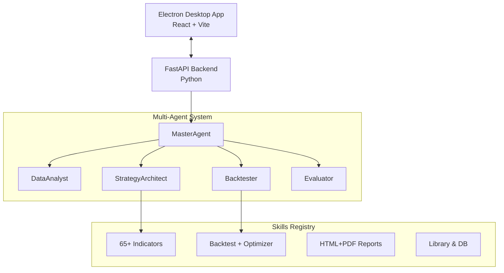

<div align="center">
  
  
  
  
  <br />
  <h1>🚀 StratForge AI</h1>
  <p><strong>Autonomous Multi-Agent Trading Strategy Research Platform</strong></p>
  <p>Design, Test, Optimize, and Validate trading strategies with zero code using a Multi-Agent LLM architecture.</p>
</div>

---

## ✨ Features Highlight

StratForge AI is a desktop application where you simply describe what you want — *"Build me a profitable intraday strategy"* — and the AI autonomously handles the rest.

- 🧠 **Autonomous Multi-Agent Loop:** Master, Analyst, Architect, Backtester, and Evaluator agents work together to research strategies.
- 🧩 **Pre-built Templates Library:** Kickstart your research with built-in templates like VWAP Breakout, Dual SuperTrend, and MACD Crossover.
- 🎨 **Sleek UI with Dark/Light Mode:** High-contrast, premium interface with seamless Theme Toggling.
- 📊 **Visual Progress Tracker:** Real-time Stepper tracking the Multi-Agent loop (Data Analyst ➔ Architect ➔ Backtester ➔ Evaluator).
- 🛠️ **Smart Alerts & Auto-Fix:** Intelligent error catching with "Fix this automatically" capabilities.
- 📑 **Comprehensive Reporting:** Automated generation of HTML and PDF reports detailing Walk-Forward, Monte Carlo, and Backtest results.
- 📤 **One-Click Share:** Easily share your profitable strategy reports to Telegram or Discord.

---

## 🏗️ Architecture



---

## 🤖 The AI Team

| Agent | LLM? | Speed | Role |
|-------|------|-------|------|
| **MasterAgent** | No | — | Orchestrates the full research loop |
| **DataAnalyst** | No | ~200ms | Computes indicators, classifies regime |
| **StrategyArchitect** | Yes | ~3s | Designs strategy variants from data profile |
| **Backtester** | No | ~5-15s | Runs full pipeline per variant |
| **Evaluator** | No | instant | Checks vetos, builds improvement feedback |

**Flow:** User Prompt → Master → Analyst → Architect → Backtester → Evaluator → (iterate if failing) → Report + Save

---

## 📊 Scoring & Validation

Strategies are rigorously stress-tested and graded **A+ to F** with hard veto gates:

- **Minimum trades:** ≥ 100
- **Max drawdown:** > -50%
- **Profit factor:** > 1.0
- **Walk-forward efficiency:** ≥ 0.5
- **Monte Carlo survival:** ≥ 70%

---

## 🔌 Skills System (Plugin Architecture)

StratForge uses a robust plugin architecture. Adding a new skill is as simple as dropping a folder into `backend/app/skills/`. No core code changes required!

- `indicator_skill/`
- `backtest_skill/`
- `report_skill/`
- `library_skill/`
- `dataset_skill/`
- `agent_skill/`

---

## 🚀 Setup & Installation

### Prerequisites
- **Node.js** 18+
- **Python** 3.11+
- **Git**

### Install

```bash
# Clone
git clone https://github.com/RahulEdward/secondversion-stratforgeai.git
cd secondversion-stratforgeai

# Frontend dependencies
npm install

# Backend dependencies
cd backend
pip install -r requirements.txt
cd ..
```

### Run the App

```bash
npm run dev
```

This starts both:
- **UI:** `http://localhost:5173` (Electron window)
- **API:** `http://127.0.0.1:8765`

---

## 🧪 Quick Test

Open a new session in the app, click **Templates Library** under the `More` menu, or type:

> *"Build me a profitable trading strategy on this data"*

The AI will autonomously research, test, iterate, and deliver the best strategy with a full report!

---

<div align="center">
  <p><b>Built with ❤️ by RahulEdward</b></p>
</div>
