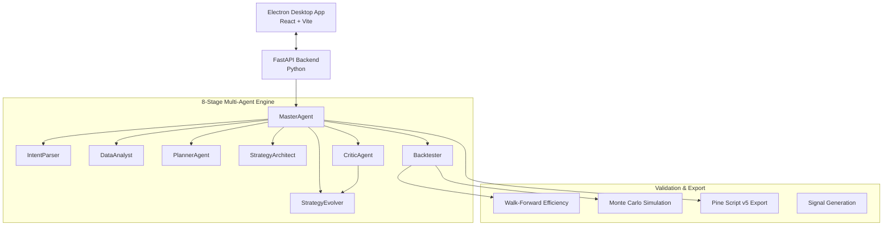

<div align="center">
  
  
  
  
  <br />
  <h1>🚀 StratForge AI</h1>
  <p><strong>Autonomous Multi-Agent Trading Strategy Research Platform</strong></p>
  <p>Design, Test, Optimize, and Validate trading strategies with zero code using an 8-Agent AI architecture.</p>
</div>

---

## ✨ Features Highlight

StratForge AI is a desktop application where you simply describe what you want — *"Build me a profitable intraday strategy"* — and the AI autonomously handles the rest.

- 🧠 **8-Agent Autonomous Loop:** IntentParser, Planner, Architect, Critic, Evolver, Backtester, Analyst, and MasterAgent work together to research strategies.
- 🧬 **Strategy Evolution & Critic Analysis:** Built-in genetic algorithms (mutation, crossover) and a harsh Critic Agent to automatically prevent curve-fitting and overfitting.
- 🧩 **7 Strategy Template Families:** Kickstart your research with built-in templates like VWAP Breakout, Dual SuperTrend, MACD Crossover, Ichimoku Cloud, and more.
- 📖 **Pro-Level Documentation:** Built-in comprehensive guide covering the technical depths of Walk-Forward Efficiency (WFE), Monte Carlo Survival Rates, and the 8-stage AI loop.
- 🎨 **Sleek UI with Visual Progress:** Real-time 8-step Stepper tracking the Multi-Agent loop with live performance metrics and dynamic gradients.
- 📑 **Comprehensive Reporting:** Automated generation of HTML and PDF reports detailing institutional-grade validation metrics.
- 📤 **Deployment Ready:** Export passing strategies directly to native **TradingView Pine Script v5** or generate formatted **Telegram/Discord signals** with one click.

---

## 🏗️ Architecture



---

## 🤖 The AI Team

| Agent | Role | Focus |
|-------|------|-------|
| **IntentParser** | Translates natural language requests into strict JSON schemas | Market, Timeframe, Style, Risk |
| **DataAnalyst** | Computes baseline indicators and classifies market regime | Trending, Ranging, Volatile |
| **PlannerAgent** | Selects logic families and strategy topology | Framework Design |
| **StrategyArchitect** | Builds 6-10 structurally diverse, non-redundant strategy variants | Technical Indicators, Risk Constraints |
| **Backtester** | Vectorized grid search and historical simulation | PnL, Drawdowns, Trade Execution |
| **CriticAgent** | Aggressive institutional stress-testing and vetoing | Overfitting detection, R:R enforcing |
| **StrategyEvolver** | Applies genetic algorithms (Crossover, Mutation, Elitism) | Strategy optimization over 5 iterations |
| **MasterAgent** | Orchestrates the entire lifecycle and compiles final results | Overall workflow control |

---

## 📊 Scoring & Validation

Strategies are rigorously stress-tested and graded **A+ to F** with hard veto gates:

- **Minimum trades:** ≥ 100
- **Max drawdown:** > -50%
- **Profit factor:** > 1.0
- **Walk-forward efficiency (WFE):** ≥ 0.5 *(Ensures out-of-sample robustness)*
- **Monte Carlo survival:** ≥ 70% *(Simulates risk of ruin via trade reshuffling)*

---

## 🚀 Setup & Installation

### Prerequisites
- **Node.js** 18+
- **Python** 3.11+
- **Git**

### Install

```bash
# Clone
git clone https://github.com/RahulEdward/secondversion-stratforgeai.git
cd secondversion-stratforgeai

# Frontend dependencies
npm install

# Backend dependencies
cd backend
pip install -r requirements.txt
cd ..
```

### Run the App

```bash
npm run dev
```

This starts both:
- **UI:** `http://localhost:5173` (Electron window)
- **API:** `http://127.0.0.1:8765`

---

## 🧪 Quick Test

Open a new session in the app and type:

> *"Build an aggressive intraday momentum strategy for XAUUSD 5m charts. Keep the maximum drawdown below 15%."*

Watch as the 8-stage pipeline parses your intent, architects variants, aggressively stress-tests them with Walk-Forward and Monte Carlo analysis, and evolves them until a profitable edge is found!

---

<div align="center">
  <p><b>Built with ❤️ by RahulEdward</b></p>
</div>
